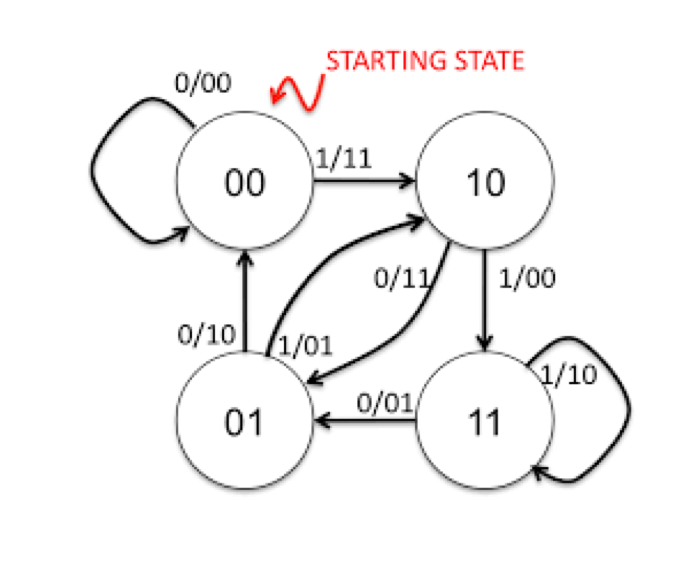
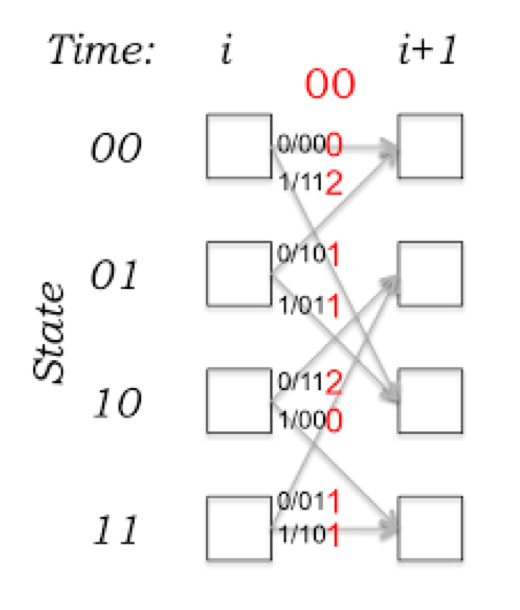

# Source and Channel Coding

In this repository I implemented a simple version of channel coding using Huffman algorithm and source coding using Convolutional encoding.

## How it Works?

**Source Coding**: For source coding, I implemented `huffman tree` as source coder and decoder. This tree build based on the alphabets we have and their frequency. The frequency of the alphabets are in `freq.txt` file.

**Channel Coding**: In this part, channel encoding implemented by a `convolutional encoder`, using below state machine. 




And then, in the receiver the content will decoded using the `Viterbi algorithm` which is a dynamic programming approach. It's working like this diagram:




## How to Run?
A simple `main.py` wroted for testing these coding/decodings. It gets an string and after source coding and then channel coding, apply some noise on it. Then it tries to decode them with channel and source coding, respectively.

```
python main.py 
```